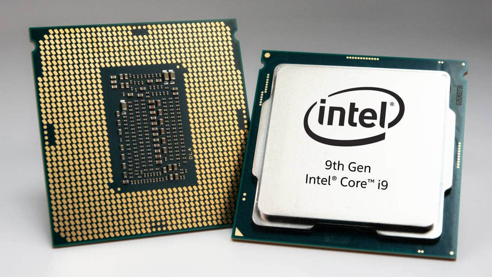
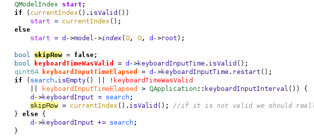
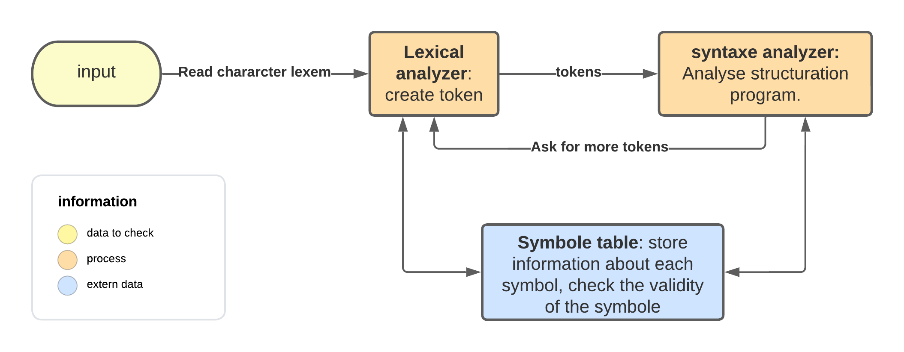

# How-work-the-compiler

### Introduction
* >Do you know how the compiler works, no?! Neither do I, so I made this article to understand how it really works.

### CPU
* The processor (`CPU` or Central Processing Unit) is the **logic circuity** that respond to basic instructions that make 
the computer running. **The brain of the computer**

* at a low level, computer processor can only do a small number of things.

  * They can read and write to memory.
  * They can do math with number they are holding.

   &nbsp;&nbsp;&nbsp;&nbsp;&nbsp;&nbsp;&nbsp;&nbsp;&nbsp;&nbsp;&nbsp;&nbsp;
   

[//]: # (   [![processor appearance]&#40;&#41;]&#40;img/processor.jpg&#41;)

### Executable Program
* Is generated by the compiler is a list of instructions for the processor to follow, they are written in binary. 
This instruction are called **machine code**

* A hex dump of an executable real mode loader   
   

   &nbsp;&nbsp;&nbsp;&nbsp;&nbsp;&nbsp;&nbsp;&nbsp;&nbsp;&nbsp;&nbsp;&nbsp;
   

[//]: # ([![hex dump example]&#40;&#41;]&#40;&#41;)

* When we talk about programming we talk about high level programming with condition, loop, etc..., 
all that is for make the work easier for the humans to understand it and this is called **source code**.
* that is called **source code**.

   &nbsp;&nbsp;&nbsp;&nbsp;&nbsp;&nbsp;&nbsp;&nbsp;&nbsp;&nbsp;&nbsp;&nbsp;
   

[//]: # (   [![source code example]&#40;&#41;]&#40;img/codebrowser_kdevelop.png&#41;)

* the compiler take this **source code** and transforme it in **machine code**.

### Sources to machine code
* >What happens when you go from source code to compiler? For the compiler, the source code is only meaningless text.
1. **Preprocessing step:** The compiler search for preprocessing directive `(#include)`.
   * The directive are **preceded by the "#" sign**.
   * If a directive is found, she is directly treated and the compiler insert the content of the file in the directive.
   * All the directive have been treated, the compiler has a modified version of source code, ready for compilation.

   &nbsp;&nbsp;&nbsp;&nbsp;&nbsp;&nbsp;&nbsp;&nbsp;&nbsp;&nbsp;&nbsp;&nbsp;
   

[//]: # (   [![pre-processor scheme]&#40;&#41;]&#40;img/Diagram_preprocessor.png&#41;)

2. **Lexical analysis:** He divides the code in individual **tokens**.
   * Each token has a **lexical unit** (keyword or symbol for example).
   * The token **syntax is a rational language** who is recognisable by the compiler.
   * He's figuring out** what for **words are in the program**.
   

   &nbsp;&nbsp;&nbsp;&nbsp;&nbsp;&nbsp;&nbsp;&nbsp;&nbsp;&nbsp;&nbsp;&nbsp;
   

[//]: # (   [![lexical analyser scheme]&#40;&#41;]&#40;img/analyzer.png&#41;)

3. **Syntax analysis:** The sequence of tokens is analyzed to check that it is a valid program according to the rules of the programming language.
* Tokens are organized into a hierarchical structure (parse tree), figuring what "grammar" is in program.
* The parse tree is often modified and improved as it is compiled.

   &nbsp;&nbsp;&nbsp;&nbsp;&nbsp;&nbsp;&nbsp;&nbsp;&nbsp;&nbsp;&nbsp;&nbsp;
   

4. Tokens are organized into a hierarchical structure (parse tree), figuring what "grammar" is in program.
5. The compiler register context about program (including variable and function names).
6. He traverse the tree and figure out if some machine code would make the same thing as the source code
* After all this stuff the compiler has finally his machine code for understand your code.
    - Ex if you want to assign to an integer the value 3, the compiler will stock the value in the memory with his particular machine code.
* If you change the source code the compiler will do de same route but with the change init a stock the new value in the memory.

## How it's works with the conditions
in working...
## references

[processor (CPU)] (https://www.techtarget.com/whatis/definition/processor)
